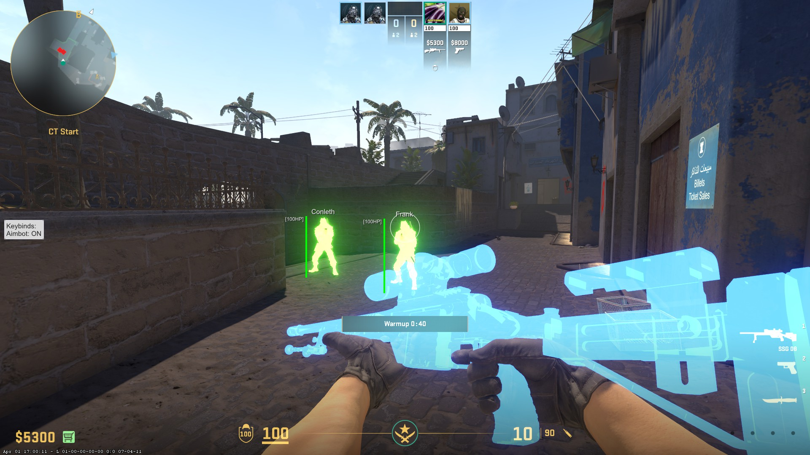
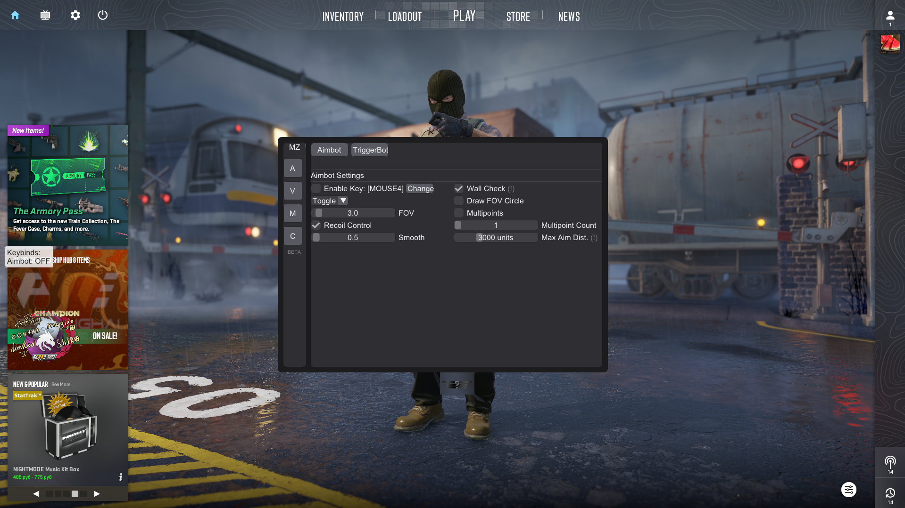

  

 

  
  
  
  
  
  

> [!CAUTION]
> USE AT YOUR OWN RISK. AT THE MOMENT EVERY CHEAT IN EXISTENCE CAN BE DETECTED

---
### Mozority is an internal cheat for CS2, developed in C++.
---

### How to Launch Mozority

1. **Download the DLL:**
   - Go to the Releases page
   - Select the desired build
   - Click on the .dll file below to download

2. **Inject the DLL:**
   - Find the `*build-date*.dll` in the `Downloads` folder.
   - Use a DLL injector (e.g., [Extreme Injector](https://github.com/master131/ExtremeInjector)) to inject `*build-date*.dll` into `cs2.exe`.

3. **Play CS2:**
   - Launch `Counter-Strike 2` and start using Mozority.
   - Inject the DLL
   - Menu Bind `END`

---

## Screenshots

| Description | Image |
|-------------|-------|
| **Showcase** |  |
| **Menu**     |  |
